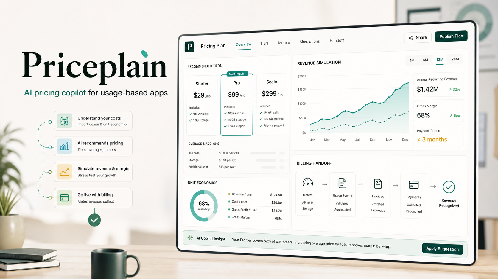
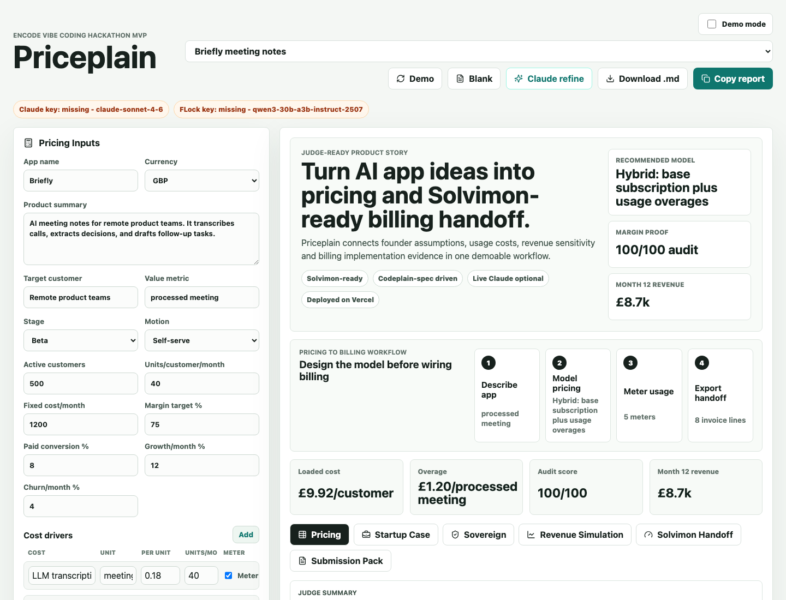
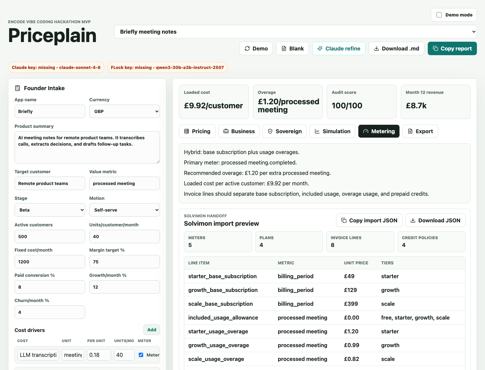
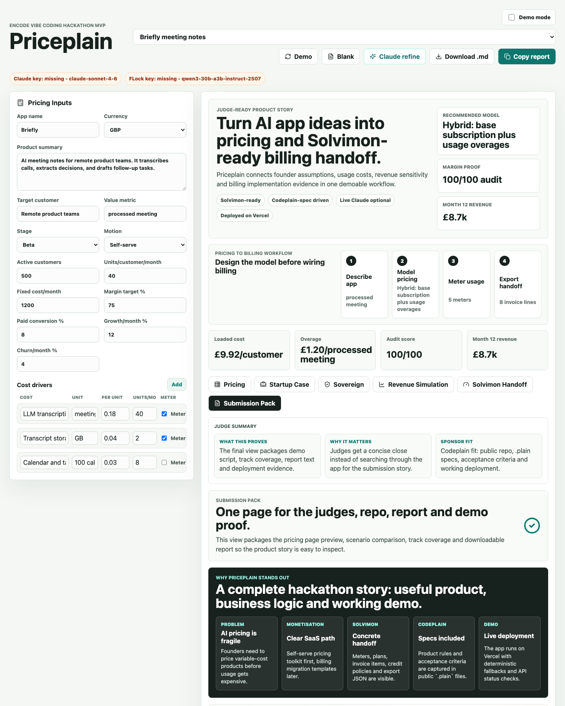

# Priceplain

AI pricing copilot for vibe-coded apps.



## Description

Priceplain helps AI app founders turn rough product descriptions and usage costs into pricing tiers, metering assumptions, revenue simulations, governance checks, and a landing-page-ready pricing table.

The product is built for founders shipping AI-native apps before they have a clear monetisation model. It asks for the app concept, target customer, value metric, usage costs, fixed costs, margin target, conversion, growth and churn, then generates a practical pricing plan.


Video Demo: https://youtu.be/aqPKt6C70FA

The hackathon focus is Solvimon and Codeplain:

- Solvimon: usage-based and hybrid pricing, metering events, Solvimon import preview, overages, credits, invoice-line assumptions, and revenue simulation.
- Codeplain: product flow, pricing rules and acceptance tests are captured in `.plain` files under `plain/`.

Secondary fit:

- Vercel: Vite front end plus serverless API routes using the Vercel AI SDK.
- FLock: deterministic Sovereign AI Review plus optional FLock-compatible provider refinement.

Out of scope for this MVP: Sui, Bilt and BGA. Those tracks require materially different products: on-chain Sui apps, mobile app distribution, or trading and portfolio systems.

### Evidence Checked

Sources checked on 20 June 2026:

| Claim | Evidence |
| --- | --- |
| Solvimon fit | Solvimon positions itself around metering, quote-to-cash, billing, payments, usage-based pricing, hybrid pricing, credits, seats and enterprise contracts. Sources: [Solvimon home](https://www.solvimon.com/), [Solvimon for AI](https://www.solvimon.com/forai), [Solvimon usage metering](https://www.solvimon.com/usage-metering). |
| Codeplain fit | Codeplain describes itself as spec-driven, production-ready code generation from plain-language specifications, and shows `.plain` specification examples. Source: [Codeplain](https://www.codeplain.ai/). |
| FLock fit | FLock documents decentralised AI, community stewardship, data sovereignty/privacy goals, an API Platform, and an OpenAI-compatible endpoint at `https://api.flock.io/v1`. Sources: [FLock introduction](https://docs.flock.io/), [FLock API Platform](https://docs.flock.io/flock-products/api-platform), [FLock API Endpoint](https://docs.flock.io/flock-products/api-platform/api-endpoint). |
| Claude model | Anthropic lists `claude-sonnet-4-6` as a current Claude API ID. Source: [Claude models overview](https://platform.claude.com/docs/en/about-claude/models/overview). |

## Table of Contents

- [Features](#features)
- [Tech Stack](#tech-stack)
- [Architecture Overview](#architecture-overview)
- [Installation](#installation)
- [Usage](#usage)
- [Configuration](#configuration)
- [Screenshots or Demo](#screenshots-or-demo)
- [Solvimon Checkout Guide](#solvimon-checkout-guide)
- [API Reference](#api-reference)
- [Tests](#tests)
- [Roadmap](#roadmap)
- [Contributing](#contributing)
- [Licence](#licence)
- [Contact or Support](#contact-or-support)

## Features

- Founder intake for product, customer, value metric, usage costs and growth assumptions.
- Four demo presets for meeting notes, coding assistance, media generation and support automation.
- Judge-friendly presentation mode that hides the intake form and adds Previous/Next controls across the core demo path.
- Judge Summary panels on every tab showing what the screen proves, why it matters and sponsor fit.
- Pricing-to-billing workflow strip showing the path from app description to exportable handoff.
- Pricing engine for Free, Starter, Growth and Scale tiers.
- Gross-margin, free-tier exposure, metering clarity and pricing-model audit signals.
- Usage-metering event suggestions for billing and analytics.
- Solvimon handoff pipeline with value metric, meter events, plans, invoice items, JSON export, a compact developer object and copy/download JSON actions.
- Twelve-month revenue, COGS, paid-customer and margin simulation.
- Sensitivity checks for model-cost shocks, usage spikes, conversion drops and churn rises.
- Saved preset comparison for loaded cost, starter pricing, month-12 revenue, margin and audit score.
- Startup Case tab explaining customer, problem, wedge, revenue path and sponsor fit.
- Sovereign AI Review for institutional governance, auditability, vendor lock-in and public-sector suitability.
- Live provider-key status check for Claude and FLock configuration without exposing secrets.
- Optional Claude refinement through a server-side API route when `ANTHROPIC_API_KEY` is configured.
- Optional FLock refinement through a server-side API route when `FLOCK_API_KEY` is configured.
- Solvimon Judge Lens mapping the project to demand, monetisation, differentiation, post-hackathon plan and demo tone.
- Submission Pack tab with pricing-page preview, “Why Priceplain stands out” close, track coverage, demo script, submission checklist, Markdown download and full report text fallback.
- Dedicated pitch pack in `docs/PITCH.md`.
- Consistent API error responses with stable codes and request IDs.
- Shareable tab URLs for demo sections such as `/?tab=business` and `/?tab=export`.

Design and product framing are adapted from usage-based billing patterns in [Orb](https://www.withorb.com/), [Metronome](https://metronome.com/) and [OpenMeter](https://openmeter.io/): revenue-design framing, role-based monetisation language, and developer-friendly metering objects. No vendor branding, copy or protected layout has been reused.

## Tech Stack

- React 19
- TypeScript 5.7
- Vite 6
- Vercel AI SDK
- Anthropic provider for Claude refinement
- FLock OpenAI-compatible API for optional sovereign review refinement
- Zod for structured Claude output validation
- Lucide React icons

## Architecture Overview

```mermaid
flowchart LR
  Founder[Founder or Judge] --> Client[React Vite App]
  Client --> Engine[Deterministic Pricing Engine]
  Client --> Sovereign[Deterministic Sovereign Review]
  Client --> PriceAPI[/api/priceplan]
  Client --> FlockAPI[/api/sovereign-review]
  PriceAPI --> Claude[Claude via Vercel AI SDK]
  FlockAPI --> FLock[FLock API]
  Client --> Specs[.plain Specs]
```

The client owns the interactive pricing workspace and runs deterministic pricing and governance analysis in the browser. Optional AI calls go through server-side API routes so provider keys stay out of the browser. The `.plain` files document product behaviour and acceptance criteria for the Codeplain submission.

## Installation

```bash
npm install
```

For reproducible installs in CI:

```bash
npm ci
```

## Usage

Start the local development server:

```bash
npm run dev
```

Useful demo paths:

- `/` - pricing workspace.
- `/?tab=business` - Startup Case for Solvimon and Codeplain.
- `/?tab=sovereign` - FLock-aligned Sovereign AI Review.
- `/?tab=simulation` - Revenue Simulation for revenue and margin assumptions.
- `/?tab=metering` - Solvimon Handoff with metering events and invoice assumptions.
- `/?tab=export` - Submission Pack with demo script, track coverage and export view.

For the clean judge flow, turn on Demo mode in the top bar. This hides the intake panel and keeps the visible tabs to Pricing, Solvimon Handoff, Revenue Simulation, Startup Case and Submission Pack.

Pitch material:

- `docs/Priceplain_Pitch_Deck.pptx` - 7-slide presentation deck for the hackathon submission.
- `docs/Priceplain_Canva_Deck.pptx` - 8-slide Canva-importable judge deck with generated hero art and screenshots.
- `docs/PITCH.md` - 30-second pitch, 90-second pitch, demo flow, judge Q&A and overclaiming guardrails.
- `docs/VIDEO_SCRIPT.md` - 3-minute Popcorn.co video script with sponsor usage and OpenAI-style planning angle.
- `docs/SUBMISSION_FORM_COPY.md` - copy-ready answers for the hackathon submission form.
- `docs/JUDGE_ONE_PAGER.md` - one-page judge summary for attaching or sharing.
- `docs/RELEVANT_FILES_INDEX.md` - index of documents, assets and specs relevant to submission.
- `docs/SOLVIMON_STARTUP_PLAN.md` - Solvimon-focused startup plan covering customer, value, monetisation and real-world viability.
- `docs/FLOCK_SOVEREIGN_AI_ONE_PAGER.md` - FLock Sovereign AI challenge fit across governance, trust and institutional adoption.
- `docs/CODEPLAIN_ONE_PAGER.md` - Codeplain explanation covering why and how the `.plain` specs shaped the build.
- `output/pdf/Priceplain_Architecture_Overview.pdf` - architecture PDF with system context, DFD, sequence flows, sponsor map and trust controls.
- `docs/SOLVIMON_CHECKOUT_GUIDE.md` - optional guide for creating a Solvimon test checkout page from the Priceplain handoff.

Build for production:

```bash
npm run build
```

Preview the production build locally:

```bash
npm run preview
```

## Configuration

Create `.env.local` for local provider calls:

```bash
ANTHROPIC_API_KEY=your_key_here
ANTHROPIC_MODEL=claude-sonnet-4-6
FLOCK_API_KEY=your_key_here
FLOCK_MODEL=qwen3-30b-a3b-instruct-2507
SOLVIMON_API_KEY=your_key_here
SOLVIMON_ENVIRONMENT=test-sandbox
```

Environment variables:

| Variable | Required | Purpose |
| --- | --- | --- |
| `ANTHROPIC_API_KEY` | No | Enables live Claude pricing refinement. Keep server-side only. |
| `ANTHROPIC_MODEL` | No | Overrides the default Claude model. |
| `FLOCK_API_KEY` | No | Enables live FLock sovereign AI refinement. Keep server-side only. |
| `FLOCK_MODEL` | No | Overrides the default FLock model. |
| `SOLVIMON_API_KEY` | No | Marks Solvimon sandbox readiness for the checkout handoff workflow. Keep server-side only. |
| `SOLVIMON_ENVIRONMENT` | No | Labels the Solvimon environment shown in provider status. |

The deterministic pricing and sovereign-review workflows work without provider credentials.

## Screenshots or Demo

Deployed demo: [https://priceplain.vercel.app](https://priceplain.vercel.app)







Recommended demo flow:

1. Load the default Briefly example on `/`.
2. Show the generated pricing tiers and audit signals.
3. Switch presets to show the model adapting across different AI products.
4. Open Solvimon Handoff to explain the value metric to meter events to invoice lines pipeline.
5. Copy or download the Solvimon JSON handoff.
6. Open Revenue Simulation to show revenue, COGS, gross-margin trajectory and sensitivity checks.
7. Open Startup Case to explain the Solvimon and Codeplain fit.
8. Open Submission Pack to show why Priceplain stands out, track coverage and the Markdown report.
9. Open Sovereign to show the governance review and FLock path if judges ask about secondary tracks.

## Solvimon Checkout Guide

Priceplain does not currently process payments directly. For a live Solvimon test checkout page, use the optional guide in [`docs/SOLVIMON_CHECKOUT_GUIDE.md`](docs/SOLVIMON_CHECKOUT_GUIDE.md).

High-level flow:

1. Create and activate a Solvimon sandbox.
2. Create a Solvimon test API key.
3. Install the Solvimon MCP server for Claude Code or Claude Desktop.
4. Ask the agent to create meters, plans and a checkout link from the Priceplain handoff.
5. Open the Solvimon checkout page and test it with a test card.

## API Reference

### `POST /api/priceplan`

Runs optional Claude refinement for the generated pricing plan.

Request body:

```json
{
  "inputs": {},
  "analysis": {}
}
```

Success response:

```json
{
  "ok": true,
  "refinement": {}
}
```

Error response:

```json
{
  "ok": false,
  "error": {
    "code": "CONFIGURATION_ERROR",
    "message": "ANTHROPIC_API_KEY is not configured.",
    "requestId": "req_123",
    "provider": "anthropic"
  }
}
```

### `POST /api/sovereign-review`

Runs optional FLock refinement for the sovereign AI review.

Request body:

```json
{
  "inputs": {},
  "analysis": {},
  "review": {}
}
```

The response uses the same success and error envelope as `/api/priceplan`.

### `GET /api/provider-status`

Reports whether server-side provider keys are configured. It does not expose key values and does not call live providers.

Success response:

```json
{
  "ok": true,
  "requestId": "req_123",
  "providers": {
    "anthropic": {
      "configured": false,
      "model": "claude-sonnet-4-6"
    },
    "flock": {
      "configured": false,
      "model": "qwen3-30b-a3b-instruct-2507"
    }
  }
}
```

## Tests

Current verification commands:

```bash
npm run build
npm run test:domain
npm run test:browser
npm audit --audit-level=moderate
npm run smoke
```

`npm run test:domain` compiles the deterministic modules to a temporary directory and checks pricing, Solvimon import preview, sensitivity scenarios and sovereign review across all demo presets.

`npm run smoke` expects the local dev server to be running and defaults to `http://localhost:3001`. Override with `SMOKE_BASE_URL` if the app is on another port. The smoke suite checks the app shell, shareable demo URLs, and stable API error envelopes without calling live AI providers.

`npm run test:browser` expects a local dev server and a Chrome or Chromium binary. Override with `BROWSER_BASE_URL` or `CHROME_BIN` if needed. It verifies rendered judge routes for Pricing, Solvimon Handoff, Revenue Simulation, Submission Pack, Startup Case and Sovereign views.

There is no lint script or full browser-click regression suite yet. Behavioural acceptance criteria are documented in `plain/acceptance-tests.plain`.

## Roadmap

- Verify the exact Codeplain config format with sponsor documentation.
- Add a saved-project workflow for repeated pricing scenarios.
- Add downloadable CSV export from the report.
- Add safe retries and circuit-breaker behaviour for live AI calls if the demo moves toward production use.
- Add server-side Claude abort support if the installed AI SDK exposes a supported timeout or abort option.
- Deploy to Vercel and record the production URL.

## Contributing

This is a hackathon MVP. Keep changes focused on the Solvimon and Codeplain story unless a sponsor requirement clearly changes.

Before submitting changes:

```bash
npm run build
```
## Contact or Support

`<@Masterasnackin>`
