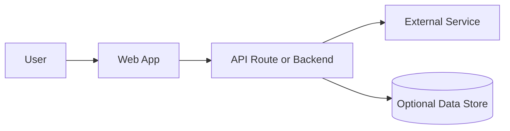

# README Skill Set

## Purpose

Use this skill to create or refresh a public-facing `README.md` that explains a project clearly, quickly and professionally. The output should help a new user understand the project, run it locally, assess its quality, and know where to contribute.

## When To Use

- A project needs a new README.
- An existing README is incomplete, stale or too vague.
- A hackathon, portfolio or open-source submission needs clearer presentation.
- A repository needs setup, usage, architecture or environment details documented.

## Inputs To Gather

Inspect the repository before writing. Prefer facts from files over assumptions.

- Project name and short tagline.
- Main purpose and target users.
- Core features.
- Tech stack and runtime versions.
- Local setup commands.
- Build, test and lint commands.
- Environment variables.
- API routes, CLI commands or key workflows.
- Deployment target and live URL, if available.
- Licence and maintainer contact, if known.

If a detail cannot be found, state it as a clear placeholder such as `<ADD LICENSE>`.

## Workflow

1. Read `package.json`, lockfiles, config files, source entry points and existing docs.
2. Identify the project type: web app, API, CLI, library, mobile app, data pipeline or hybrid.
3. Extract verified commands for install, development, build and tests.
4. Draft the README in GitHub-flavoured Markdown.
5. Include a concise architecture diagram using Mermaid.
6. Check that all links, headings and commands are consistent.
7. Keep unknowns explicit and editable.

## Required Structure

Use these sections in this order unless the repository clearly requires a different order:

1. Title and one-line tagline.
2. Badges, only if meaningful or marked as placeholders.
3. Description.
4. Table of Contents.
5. Features.
6. Tech Stack.
7. Architecture Overview.
8. Installation.
9. Usage.
10. Configuration.
11. Screenshots or Demo.
12. API or CLI Reference, if relevant.
13. Tests.
14. Roadmap.
15. Contributing.
16. Licence.
17. Contact or Support.

## Architecture Diagram Requirement

Include one Mermaid diagram. Keep it simple and valid.

After the diagram, add 2-3 sentences explaining the main components and data flow.

## Quality Bar

- A new reader understands the project in under one minute.
- Setup commands are copy-pasteable.
- Environment variables are listed with purpose and safety notes.
- The document is honest about missing tests, missing deployment or unknown licence.
- No invented features, fake badges, fake links or unsupported claims.

## Output Rules

- Use clean British English.
- Use GitHub-flavoured Markdown.
- Return only the finished README content when asked to generate a README.
- Do not include hidden reasoning or commentary in the generated README.
- Do not use decorative formatting or emojis.
