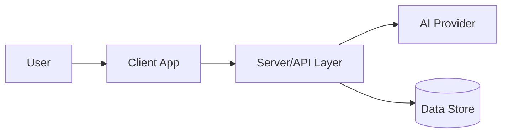

# Architecture Skill Set

## Purpose

Use this skill to create or update an `ARCHITECTURE.md` document that explains how a system is structured, why it is structured that way, and what trade-offs matter.

## When To Use

- A project needs an architecture overview for maintainers, judges or reviewers.
- A system has multiple components, external integrations or non-obvious data flow.
- A deployment, security or scalability story needs to be documented.
- A technical handover requires clear system boundaries.

## Inputs To Gather

Read the repository before writing. Gather:

- Project name and product purpose.
- System type: SPA, full-stack web app, API, CLI, library, pipeline or mobile app.
- Frontend, backend, data storage and external services.
- API routes or service boundaries.
- Build and deployment model.
- Environment variables and secrets.
- Critical workflows.
- Known constraints, risks and future improvements.

Mark missing facts with `<ADD DETAIL>` rather than inventing them.

## Required Structure

1. `# System Architecture: <Project Name>`
2. Overview.
3. Key Requirements.
4. High-Level Architecture.
5. Component Details.
6. Data Flow.
7. Data Model.
8. Infrastructure and Deployment.
9. Scalability and Reliability.
10. Security and Compliance.
11. Observability.
12. Design Decisions and Trade-offs.
13. Future Improvements.

## Diagram Requirements

Include at least one Mermaid diagram. Prefer a system context or container diagram.

Include a brief explanation under each diagram. The diagram should show boundaries and dependencies, not every file.

## Component Detail Format

For each major component, document:

- Responsibilities.
- Main technologies.
- Data owned or transformed.
- External dependencies.
- Failure modes or operational concerns.

## Security Guidance

Always cover:

- Secrets management.
- Client/server trust boundaries.
- Authentication and authorisation, if present.
- Sensitive data handling.
- Third-party provider risk.
- Auditability and logging.

If the system currently lacks a security feature, state that plainly.

## Quality Bar

- The document is understandable without reading the whole codebase.
- Diagrams are valid, minimal and useful.
- Assumptions are labelled.
- Trade-offs explain why choices were made.
- Future improvements are concrete rather than generic.

## Output Rules

- Use GitHub-flavoured Markdown.
- Use neutral British English.
- Return only the finished architecture document when generating output.
- Do not overstate scalability, security or production readiness.
